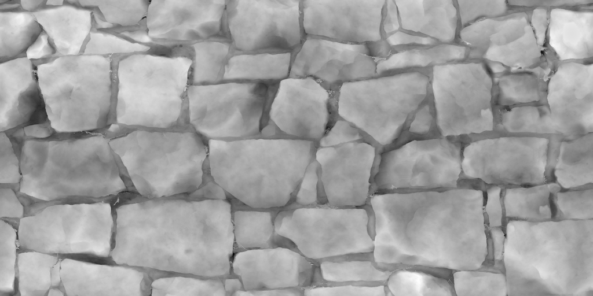
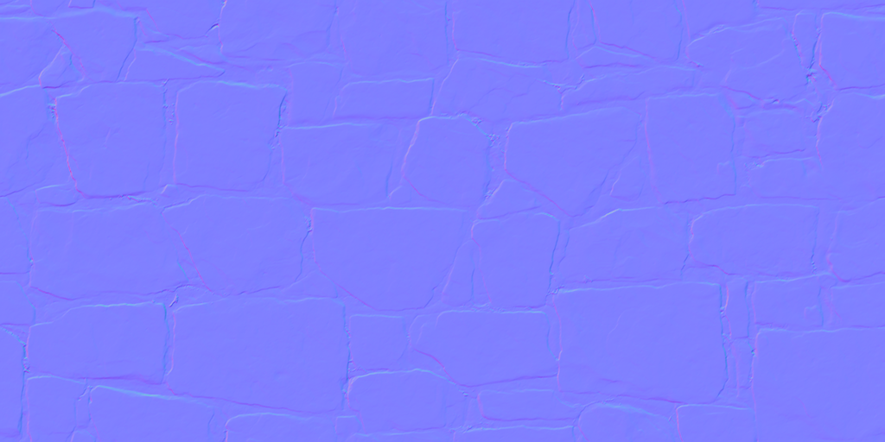
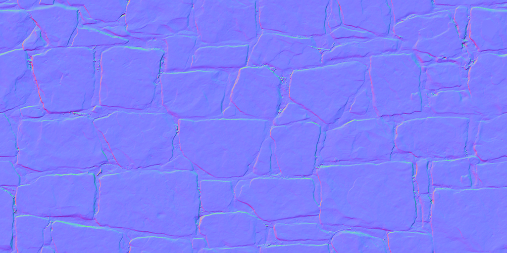
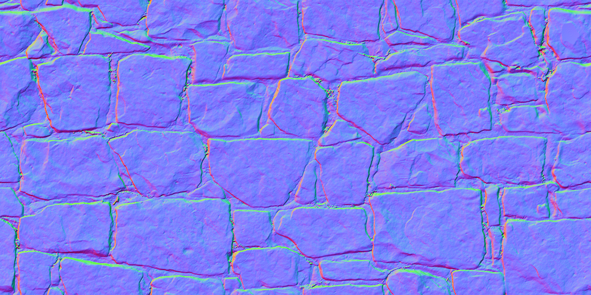

# Normal map generator written in Rust language.

This repository provides you with a function image to normal map.
```rust
fn image_to_normal_map(image: &DynamicImage, strength: f64) -> DynamicImage
```

## Usage: 
`Cargo.toml`  
```
[dependencies]
normal-map-generator-rs = { git = "https://github.com/sakikuroe/normal-map-generator-rs" }
```

## Demo: 
```rust
use normal_map_generator_rs::image_to_normal_map;

fn main() {
    let img = image::open("pictures/src/Bricks075A_1K_Displacement.png").unwrap();
    for strength in [1.0, 3.0, 10.0] {
        let output = image_to_normal_map(&img, strength);
        output.save(format!("pictures/dst/strength_{}.png", strength)).unwrap();
    }
}
```

### original image (ambientCG.com: [Bricks075A_1K_Displacement.png](https://ambientcg.com/view?id=Bricks075A), licensed under the Creative Commons CC0 1.0 Universal License.)

### normal map (strength = 1.0)

### normal map (strength = 3.0)

### normal map (strength = 10.0)


